# Housely - Print-Friendly Mermaid Diagrams

> Each diagram uses Times New Roman and larger text for printing.

---

## 1. System Architecture (3-Tier)

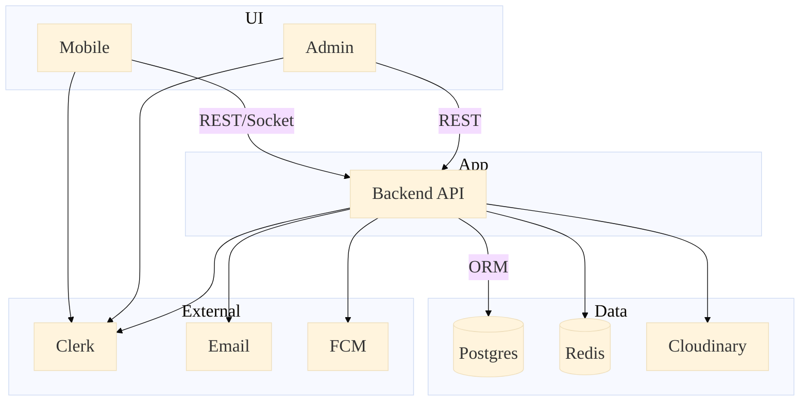

---

## 2. DFD Level 0 (Context)

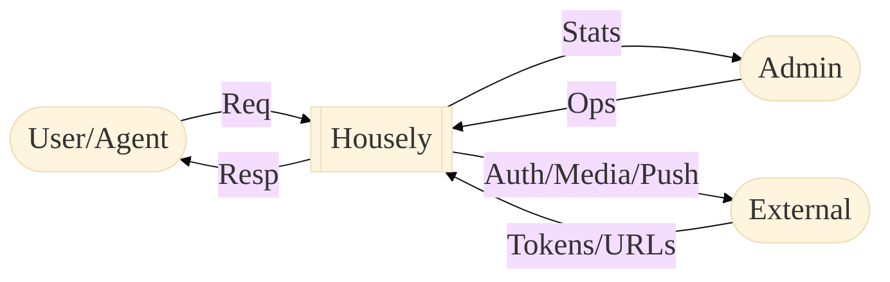

---

## 3. DFD Level 1 (Main)

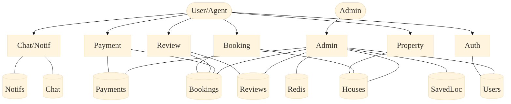

---

## 4. DFD Level 2 (Property Search)

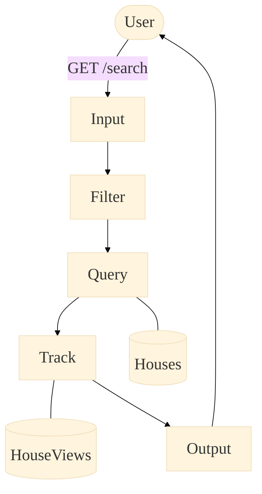

---

## 5. ERD (Compact)

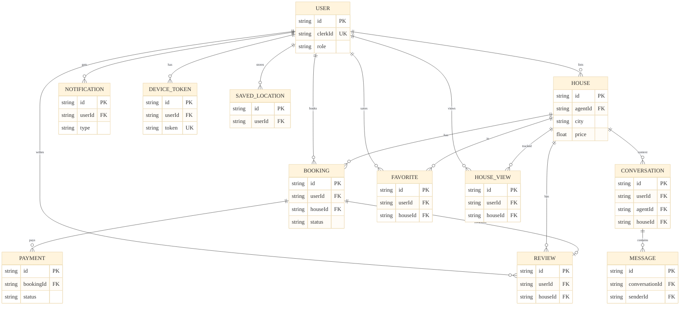

---

## 6. Booking FSM

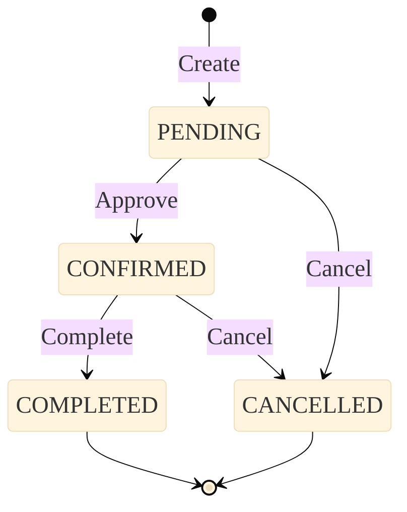

---

## 7. Use Case (User + Agent)

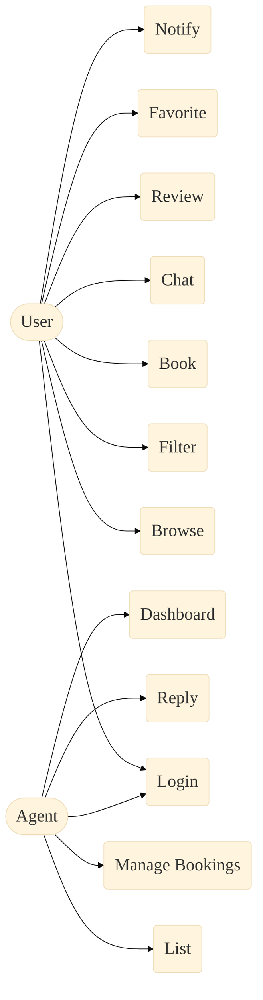

---

## 8. Use Case (Admin + System)

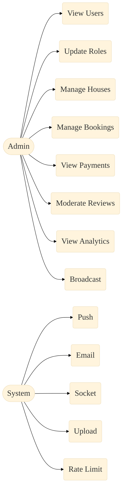

---

## 9. App Flow (Happy Path)

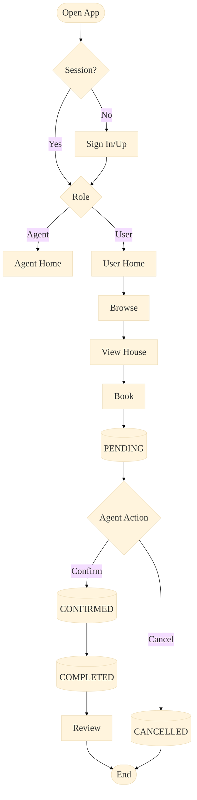

---

## 10. UML Component (Compact)

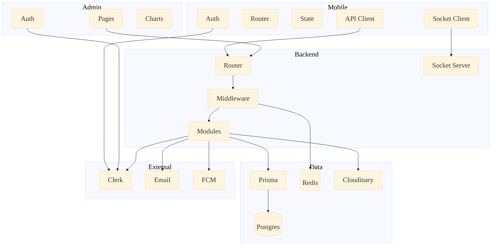

---

## 11. Class Diagram (Compact)

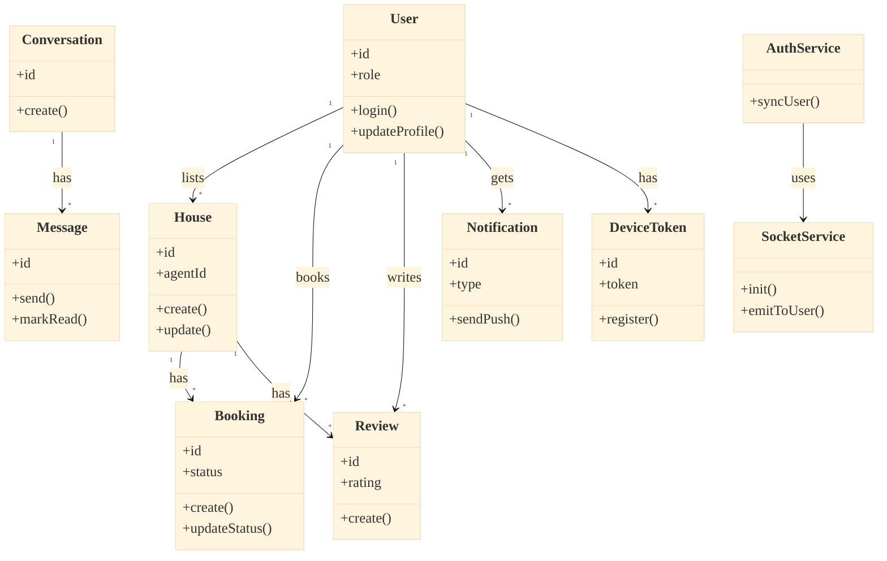

---

## 12. Sequence (Auth Login)

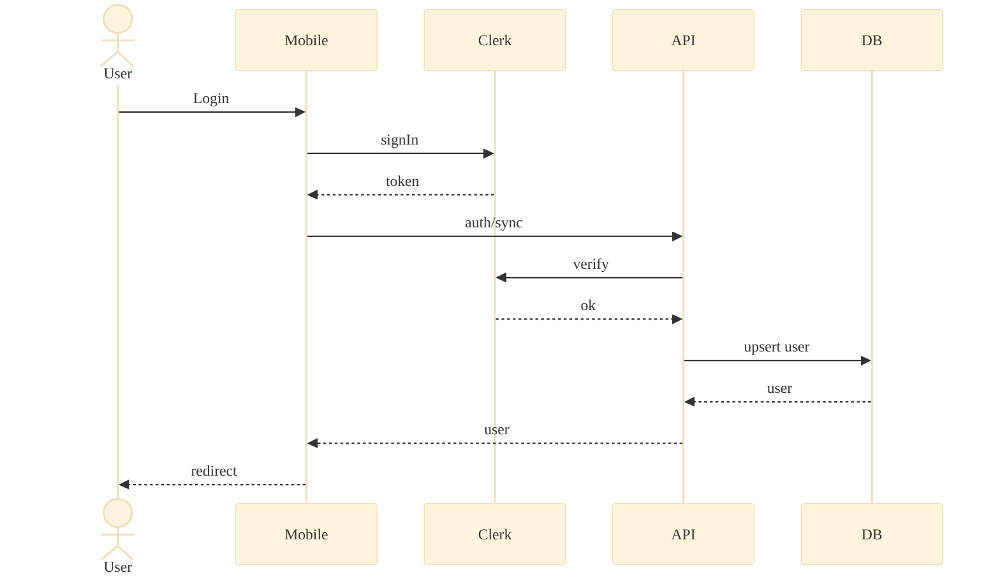

---

## 13. Sequence (Token Refresh)

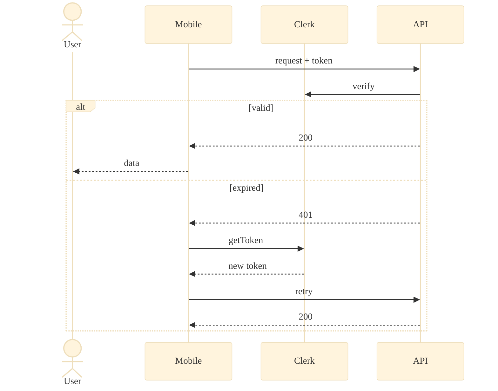

---

## 14. Sequence (Messaging)

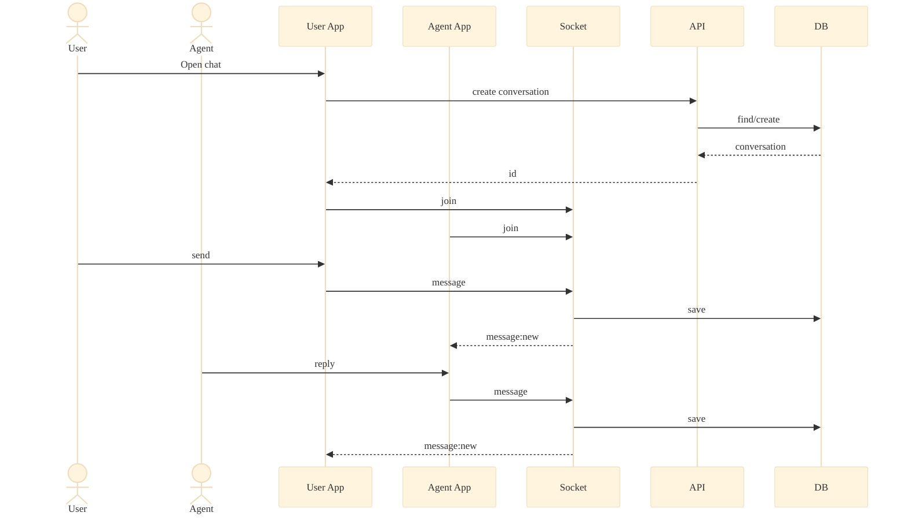

---

## 15. Activity (Booking)

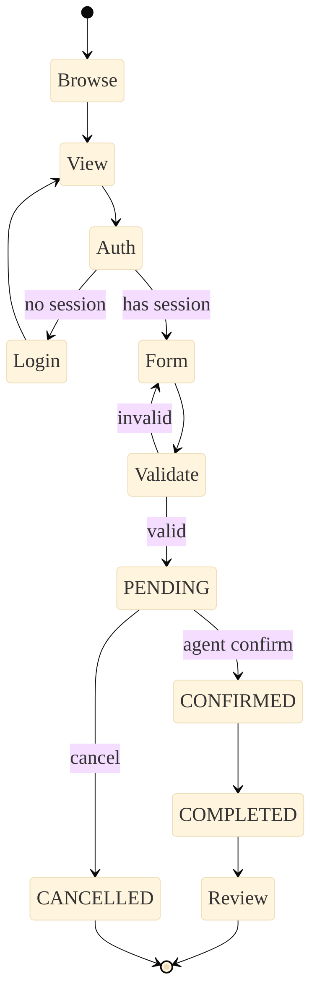

---

## 16. Activity (Password Reset)

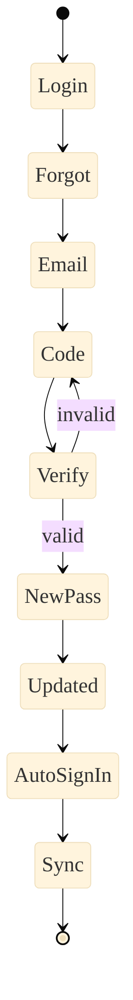

---

## Summary Table

| # | Diagram | Type | Scope |
|---|---------|------|-------|
| 1 | Architecture | graph TB | UI, API, Data, External |
| 2 | DFD L0 | graph LR | Context flow |
| 3 | DFD L1 | graph TD | Core processes |
| 4 | DFD L2 | graph TD | Search path |
| 5 | ERD | erDiagram | Core entities |
| 6 | Booking FSM | stateDiagram-v2 | Status transitions |
| 7 | Use Case User/Agent | graph LR | Main actions |
| 8 | Use Case Admin/System | graph LR | Ops and automation |
| 9 | App Flow | flowchart TD | Happy path |
| 10 | Component | graph TB | Major modules |
| 11 | Class | classDiagram | Core classes |
| 12 | Sequence Auth | sequenceDiagram | Login sync |
| 13 | Sequence Token | sequenceDiagram | Refresh flow |
| 14 | Sequence Chat | sequenceDiagram | Real-time messaging |
| 15 | Activity Booking | stateDiagram-v2 | Book lifecycle |
| 16 | Activity Reset | stateDiagram-v2 | Password reset |
