# Housely – All System Development Mermaid Diagrams

> Paste any block into [mermaid.live](https://mermaid.live) or any Markdown renderer
> that supports Mermaid to preview and export as PNG/SVG.

---

## 1. System Architecture Diagram (Three-Tier)

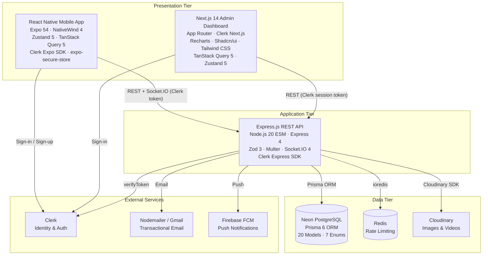

---

## 2. DFD Level 0 – Context Diagram

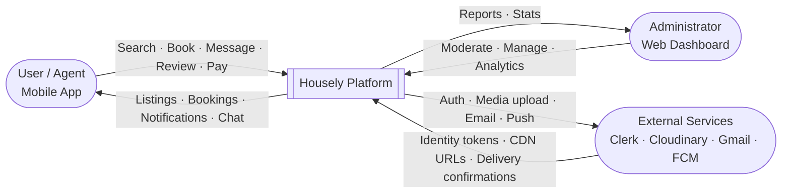

---

## 3. DFD Level 1 – Main Processes

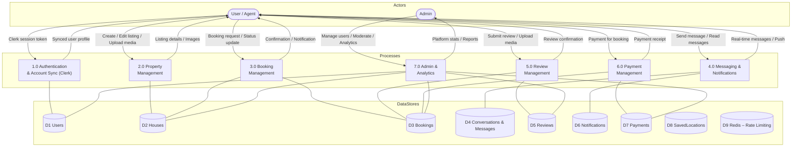

---

## 4. DFD Level 2 – Property Search Drill-down

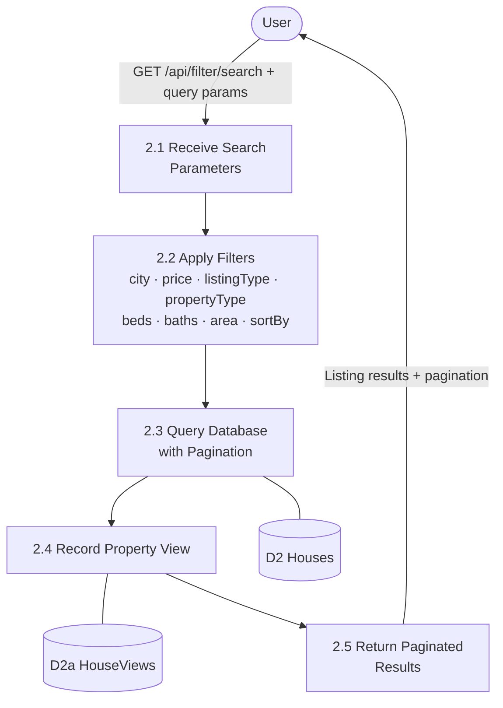

---

## 5. Entity Relationship Diagram (ERD)

```mermaid
erDiagram
    USER {
        string id           PK
        string clerkId      UK
        string username     UK
        string email        UK
        string password
        string phoneNumber  UK
        string name
        string bio
        datetime dateOfBirth
        string avatar
        enum   role         "USER | AGENT | ADMIN"
        enum   authProvider "LOCAL | GOOGLE | FACEBOOK"
        string googleId     UK
        string facebookId   UK
        bool   isVerified
        datetime createdAt
        datetime updatedAt
    }
    SAVED_LOCATION {
        string id       PK
        string userId   FK
        string label
        string address
        string city
        string area
        string street
        float  latitude
        float  longitude
        datetime createdAt
    }
    HOUSE {
        string id           PK
        string name
        string description
        enum   status       "AVAILABLE | UNAVAILABLE"
        float  rentPerMonth
        float  salePrice
        enum   listingType  "RENT | SALE"
        enum   propertyType "APARTMENT | PENTHOUSE | HOTEL | VILLA | STUDIO | DUPLEX | TOWNHOUSE | CONDO"
        string address
        string city
        string area
        float  latitude
        float  longitude
        int    bedrooms
        int    bathrooms
        float  sizeInSqft
        int    buildYear
        bool   hasWifi
        bool   hasWater
        string agentId      FK
        datetime createdAt
        datetime updatedAt
    }
    HOUSE_IMAGE {
        string id       PK
        string houseId  FK
        string url
        int    order
    }
    HOUSE_VIDEO {
        string id       PK
        string houseId  FK "unique"
        string url
    }
    PUBLIC_FACILITY {
        string id               PK
        string houseId          FK "unique"
        bool   wifi
        bool   water
        bool   electricity
        bool   parking
        float  mosqueDistance
        float  hospitalDistance
        float  shoppingMallDistance
        float  marketDistance
    }
    BOOKING {
        string   id            PK
        string   userId        FK
        string   houseId       FK
        string   agentId       FK
        datetime checkIn
        datetime checkOut
        float    totalAmount
        enum     status        "PENDING | CONFIRMED | COMPLETED | CANCELLED"
        enum     paymentStatus "PENDING | COMPLETED | FAILED | REFUNDED"
        string   notes
        datetime createdAt
        datetime updatedAt
    }
    PAYMENT {
        string id             PK
        string userId         FK
        string bookingId      FK
        float  amount
        string currency
        string method
        string transactionId  UK
        enum   status         "PENDING | COMPLETED | FAILED | REFUNDED"
        datetime createdAt
    }
    REVIEW {
        string   id        PK
        string   userId    FK
        string   houseId   FK
        string   bookingId FK "unique"
        int      rating
        string   comment
        datetime createdAt
        datetime updatedAt
    }
    REVIEW_MEDIA {
        string id       PK
        string reviewId FK
        string url
        string type     "image | video"
    }
    CONVERSATION {
        string   id        PK
        string   userId    FK
        string   agentId   FK
        string   houseId   FK
        datetime createdAt
        datetime updatedAt
    }
    MESSAGE {
        string   id             PK
        string   conversationId FK
        string   senderId       FK
        string   content
        string   type           "text | image | audio | video"
        bool     isRead
        datetime createdAt
    }
    NOTIFICATION {
        string   id        PK
        string   userId    FK
        enum     type      "BOOKING_CONFIRMED | BOOKING_CANCELLED | PAYMENT_SUCCESS | NEW_MESSAGE | REVIEW_POSTED | GENERAL"
        string   title
        string   message
        json     data
        bool     isRead
        datetime createdAt
    }
    NOTIFICATION_SETTINGS {
        string id             PK
        string userId         FK "unique"
        bool   pushEnabled
        bool   emailEnabled
        bool   smsEnabled
        bool   bookingUpdates
        bool   promotions
    }
    DEVICE_TOKEN {
        string id        PK
        string userId    FK
        string token     UK
        string platform  "android | ios"
        datetime createdAt
    }
    HOUSE_VIEW {
        string   id       PK
        string   userId   FK
        string   houseId  FK
        datetime viewedAt
    }
    FAVORITE {
        string id        PK
        string userId    FK
        string houseId   FK
    }

    USER              ||--o{ SAVED_LOCATION       : "saves"
    USER              ||--o{ HOUSE                : "lists as agent"
    USER              ||--o{ BOOKING              : "creates (user)"
    USER              ||--o{ BOOKING              : "receives (agent)"
    USER              ||--o{ PAYMENT              : "makes"
    USER              ||--o{ REVIEW               : "writes"
    USER              ||--o{ NOTIFICATION         : "receives"
    USER              ||--o| NOTIFICATION_SETTINGS: "configures"
    USER              ||--o{ DEVICE_TOKEN         : "registers"
    USER              ||--o{ HOUSE_VIEW           : "generates"
    USER              ||--o{ FAVORITE             : "saves"
    USER              ||--o{ CONVERSATION         : "starts (user)"
    USER              ||--o{ CONVERSATION         : "receives (agent)"
    USER              ||--o{ MESSAGE              : "sends"

    HOUSE             ||--o{ HOUSE_IMAGE          : "has"
    HOUSE             ||--o| HOUSE_VIDEO          : "has"
    HOUSE             ||--o| PUBLIC_FACILITY      : "has"
    HOUSE             ||--o{ BOOKING              : "subject of"
    HOUSE             ||--o{ REVIEW               : "receives"
    HOUSE             ||--o{ HOUSE_VIEW           : "tracked by"
    HOUSE             ||--o{ FAVORITE             : "saved in"
    HOUSE             ||--o{ CONVERSATION         : "linked to"

    BOOKING           ||--o| REVIEW               : "reviewed after"
    BOOKING           ||--o{ PAYMENT              : "paid via"

    REVIEW            ||--o{ REVIEW_MEDIA         : "has"

    CONVERSATION      ||--o{ MESSAGE              : "contains"
```

---

## 6. Booking Lifecycle Finite-State Machine

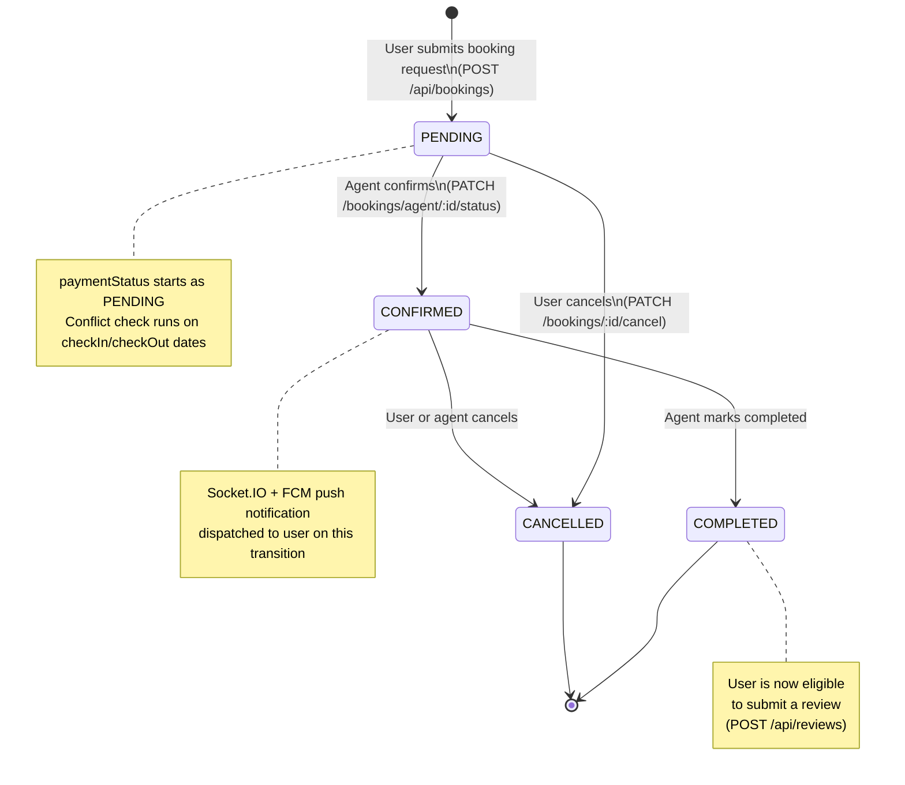

---

## 7. Use Case Diagram – User and Agent Workflows

```mermaid
graph LR
    subgraph Actors
        U(["USER"])
        A(["AGENT"])
    end

    subgraph AuthModule["Authentication (Clerk)"]
        UC1(Register Account)
        UC2(Login)
        UC3(Change Password)
        UC4(Select Role at Signup)
    end

    subgraph PropertyModule["Property Discovery"]
        UC5(Browse Listings)
        UC6(Apply Advanced Filters)
        UC7(View Property Details)
        UC8(Save to Favourites)
        UC9(View Saved Locations)
        UC10(Browse Nearby Properties)
        UC11(Browse Popular Properties)
        UC12(Browse Recommended)
        UC13(Browse Top Locations)
    end

    subgraph BookingModule["Booking"]
        UC14(Submit Booking Request)
        UC15(View My Bookings)
        UC16(Cancel Booking)
        UC17(Accept Booking Request)
        UC18(Reject / Cancel Booking)
    end

    subgraph MessagingModule["Messaging"]
        UC19(Start Conversation with Agent)
        UC20(Send Message)
        UC21(Receive Real-time Message)
        UC22(Mark Messages as Read)
    end

    subgraph ReviewModule["Review"]
        UC23(Submit Review after Booking)
        UC24(View Property Reviews)
        UC25(Update Own Review)
        UC26(Delete Own Review)
    end

    subgraph AgentModule["Agent Portal"]
        UC27(Create Property Listing)
        UC28(Edit Listing Details)
        UC29(Upload Images and Videos)
        UC30(View Agent Dashboard)
        UC31(View Earnings Overview)
        UC32(Manage Agent Bookings)
    end

    subgraph NotifModule["Notifications"]
        UC33(Receive Push Notifications)
        UC34(Mark Notifications as Read)
        UC35(Register Device Token)
        UC36(Manage Notification Settings)
    end

    subgraph LocationModule["Location"]
        UC37(Save Location)
        UC38(Reverse Geocode)
        UC39(View Saved Locations)
    end

    U --> UC1
    U --> UC2
    U --> UC3
    U --> UC4
    U --> UC5
    U --> UC6
    U --> UC7
    U --> UC8
    U --> UC9
    U --> UC10
    U --> UC11
    U --> UC12
    U --> UC14
    U --> UC15
    U --> UC16
    U --> UC19
    U --> UC20
    U --> UC21
    U --> UC22
    U --> UC23
    U --> UC24
    U --> UC33
    U --> UC34
    U --> UC35
    U --> UC36
    U --> UC37
    U --> UC38
    U --> UC39

    A --> UC2
    A --> UC17
    A --> UC18
    A --> UC20
    A --> UC21
    A --> UC24
    A --> UC25
    A --> UC27
    A --> UC28
    A --> UC29
    A --> UC30
    A --> UC31
    A --> UC32
    A --> UC33
    A --> UC34
```

---

## 8. Use Case Diagram – Admin and System Side Effects

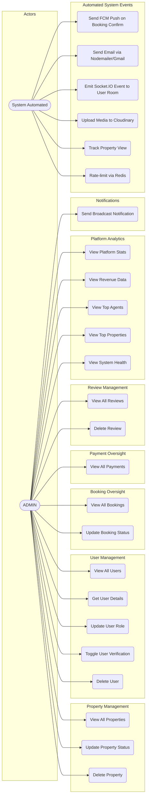

---

## 9. Application Flow Diagram (Happy Path)

```mermaid
flowchart TD
    A([User opens App]) --> B{Clerk session\nexists?}
    B -- No --> C[Onboarding Screens]
    C --> D{New or existing?}
    D -- New --> E[Clerk Sign-up]
    E --> F{Role selected?}
    F -- AGENT --> G[Agent Portal /(owner)/]
    F -- USER  --> H[Set Location / Home /(tabs)/]
    D -- Existing --> I[Clerk Login]
    I --> J{User role?}
    J -- AGENT --> G
    J -- USER  --> H
    B -- Yes --> K[POST /api/auth/sync]
    K --> J

    H --> L[Home Feed – Recommended / Popular Listings]

    L --> M{User Action}
    M -- Filter/Search  --> N[GET /api/filter/search\ncity · price · propertyType · beds]
    M -- View listing   --> O[Property Detail Page\nGET /api/houses/:id]
    M -- Chat           --> P[Open Conversation\nPOST /api/conversations]
    M -- Profile        --> Q[View / Edit Profile\nGET /api/users/me]

    N --> O
    O --> R{Signed in as USER?}
    R -- Yes --> S[Submit Booking Request\nPOST /api/bookings]
    R -- No  --> I

    S --> T[(Booking → PENDING)]
    T --> U[Agent notified via\nSocket.IO + FCM]
    U --> V{Agent Decision\nPATCH /bookings/agent/:id/status}
    V -- CONFIRMED --> W[(Booking → CONFIRMED)]
    V -- CANCELLED --> X[(Booking → CANCELLED)]

    W --> Y[User notified via\nSocket.IO + FCM]
    Y --> Z{Agent marks\nCOMPLETED}
    Z --> AA[(Booking → COMPLETED)]
    AA --> AB[User submits Review\nPOST /api/reviews]
    AB --> AC([End])
    X --> AC
```

---

## 10. UML Component Diagram

```mermaid
graph TB
    subgraph MobileApp["React Native Mobile App (Expo 54)"]
        MA_AUTH["Auth Screens\nClerk Sign-in · Sign-up · Role Selection\nChange / Forgot / Reset Password"]
        MA_NAV["Expo Router\nFile-based Navigation\n/(tabs)/ · /(owner)/"]
        MA_STATE["Zustand Store\nAuthStore · LocationStore"]
        MA_QUERY["TanStack Query 5\nServer State Cache"]
        MA_AXIOS["Axios Client\nClerk token interceptor"]
        MA_SOCK["Socket.IO Client\nClerk token handshake"]
        MA_SCREENS["User Screens\nHome · Explore · Bookings · Favorites\nChat · Notifications · Profile\nNearby · Popular · Recommended"]
        MA_AGENT["Agent Portal\nListings · Bookings · Earnings\nMessages · Reviews · Dashboard"]
        MA_CLERK["@clerk/clerk-expo\nexpo-secure-store token cache"]
    end

    subgraph AdminDash["Next.js 14 Admin Dashboard"]
        AD_AUTH["@clerk/nextjs\nclerkMiddleware · Clerk session"]
        AD_PAGES["Server & Client Components"]
        AD_CHARTS["Recharts\nAnalytics Visualisation"]
        AD_QUERY["TanStack Query 5\nClient Cache"]
        AD_UI["Shadcn/ui + Tailwind\nUI Components"]
        AD_MODULES["Dashboard · Users · Properties\nBookings · Payments · Reviews\nRevenue · Notifications"]
    end

    subgraph BackendAPI["Express.js REST API (Node.js 20)"]
        BE_ROUTER["Express Router\n10 Route Modules"]
        BE_MIDDLE["Middleware\nprotect (Clerk) · requireRole · errorHandler"]
        BE_AUTH["Auth Module\nPOST /auth/sync — upsert Clerk user"]
        BE_HOUSE["House Module\nCRUD · Cloudinary upload · Filters"]
        BE_FILTER["Filter Module\nAdvanced search + pagination"]
        BE_BOOK["Booking Module\nFSM · date conflict check"]
        BE_MSG["Message Module\nConversations + Socket.IO"]
        BE_REVIEW["Review Module\nWith ReviewMedia"]
        BE_NOTIF["Notification Module\nFCM push · DeviceToken"]
        BE_ADMIN["Admin Module\nStats · Revenue · User/House mgmt"]
        BE_LOC["Location Module\nReverse Geocode · SavedLocations"]
        BE_USER["User Module\nProfile · Avatar · Payment history"]
        BE_PAY["Payment Model\n(via Booking service)"]
        BE_ZOD["Zod 3\nInput Validation"]
        BE_SOCK["Socket.IO Server\nClerk token handshake\nmessage:send · conversation:join"]
        BE_CLERK["@clerk/express\nclerkMiddleware · getAuth · verifyToken"]
    end

    subgraph DataLayer["Data Layer"]
        PRISMA["Prisma 6 ORM"]
        PG[("Neon PostgreSQL\n20 Models · 7 Enums")]
        REDIS[("Redis\nRate Limiting")]
        CLD["Cloudinary\nImages & Videos"]
    end

    subgraph ExtServices["External Services"]
        CLERK_SVC["Clerk\nIdentity & Auth"]
        NODEMAILER["Nodemailer / Gmail"]
        FCM_SVC["Firebase FCM"]
    end

    MA_AXIOS  --> BE_ROUTER
    MA_SOCK   --> BE_SOCK
    MA_CLERK  --> CLERK_SVC
    AD_PAGES  --> BE_ROUTER
    AD_QUERY  --> BE_ROUTER
    AD_AUTH   --> CLERK_SVC

    BE_ROUTER --> BE_MIDDLE
    BE_MIDDLE --> BE_AUTH
    BE_MIDDLE --> BE_HOUSE
    BE_MIDDLE --> BE_FILTER
    BE_MIDDLE --> BE_BOOK
    BE_MIDDLE --> BE_MSG
    BE_MIDDLE --> BE_REVIEW
    BE_MIDDLE --> BE_NOTIF
    BE_MIDDLE --> BE_ADMIN
    BE_MIDDLE --> BE_LOC
    BE_MIDDLE --> BE_USER

    BE_BOOK   --> BE_ZOD
    BE_HOUSE  --> BE_ZOD
    BE_CLERK  --> CLERK_SVC

    BE_AUTH   --> PRISMA
    BE_HOUSE  --> PRISMA
    BE_FILTER --> PRISMA
    BE_BOOK   --> PRISMA
    BE_MSG    --> PRISMA
    BE_REVIEW --> PRISMA
    BE_NOTIF  --> PRISMA
    BE_ADMIN  --> PRISMA
    BE_LOC    --> PRISMA
    BE_USER   --> PRISMA
    BE_PAY    --> PRISMA

    PRISMA    --> PG
    BE_HOUSE  --> CLD
    BE_REVIEW --> CLD
    BE_USER   --> CLD
    BE_NOTIF  --> FCM_SVC
    BE_AUTH   --> NODEMAILER
    BE_MIDDLE --> REDIS
    BE_SOCK   --> PRISMA
```

---

## 11. Class Diagram

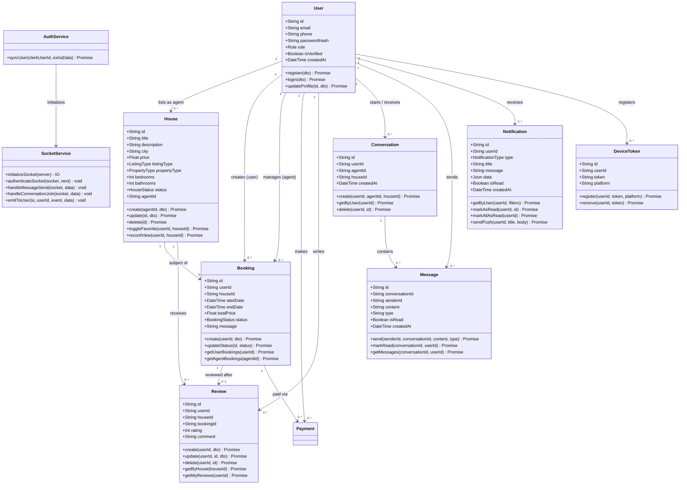

---

## 12. Sequence Diagram – Authentication (Clerk-based Login)

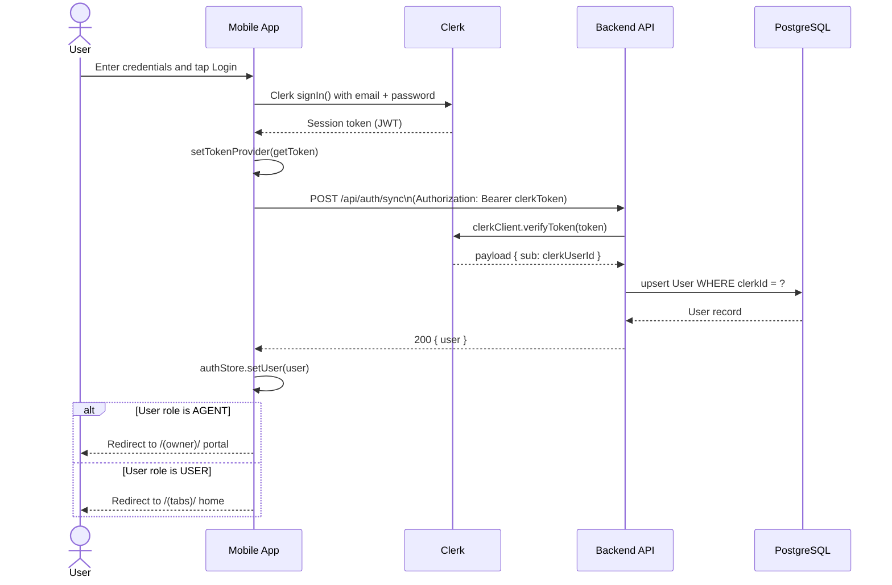

---

## 13. Sequence Diagram – Clerk Token Lifecycle (Silent Refresh)

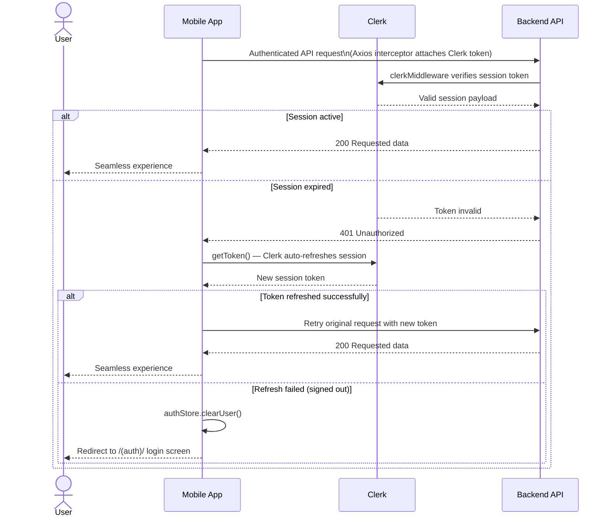

---

## 14. Sequence Diagram – Real-time Messaging

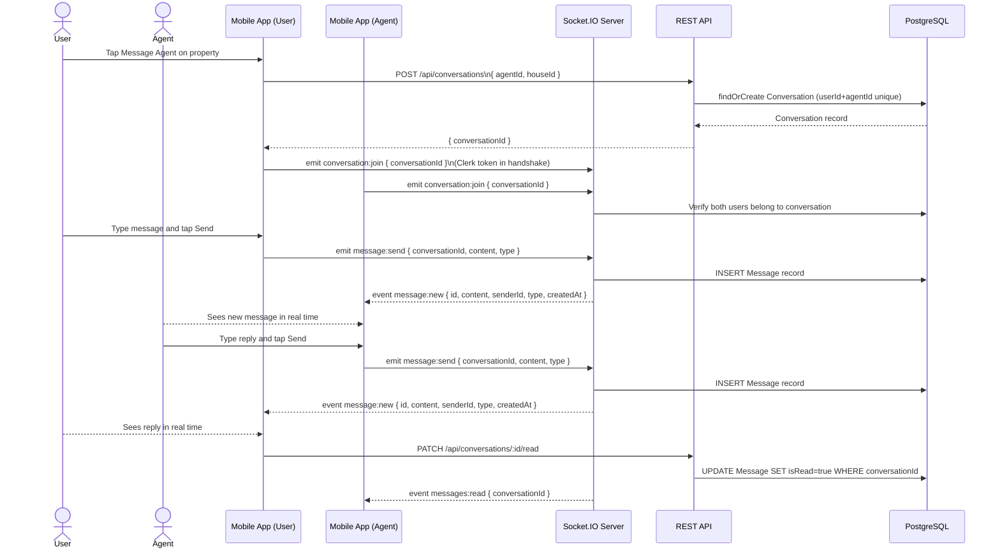

---

## 15. Activity Diagram – User Booking Flow

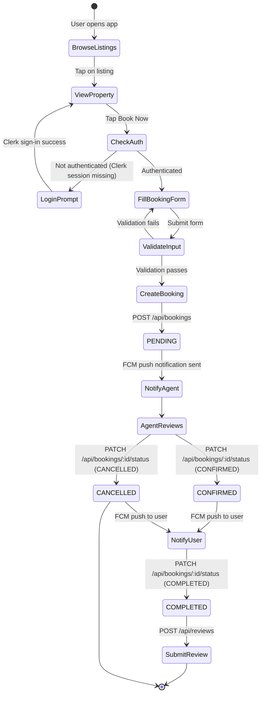

---

## 16. Activity Diagram – Clerk-managed Password Reset Flow

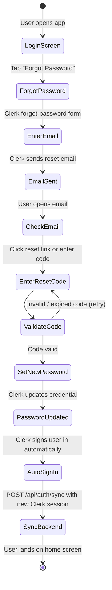

---

## Summary Table

| # | Diagram | Mermaid Type | Description |
|---|---------|--------------|-------------|
| 1 | System Architecture – Three-Tier | `graph TB` | Mobile + Admin → Express API → Neon PostgreSQL; Clerk auth; Cloudinary; FCM; Redis rate limiting |
| 2 | DFD Level 0 – Context | `graph LR` | Top-level data flows between User, Agent, Admin, Clerk, Cloudinary, FCM, PostgreSQL |
| 3 | DFD Level 1 – Main Processes | `graph TD` | Six core processes: Auth Sync, Property Mgmt, Booking & Payment, Messaging, Notifications, Filter/Search |
| 4 | DFD Level 2 – Property Search | `graph TD` | Filter pipeline: query params → Redis rate limit → Prisma query → Cloudinary URLs |
| 5 | Entity Relationship Diagram | `erDiagram` | All 20 Prisma models with fields and relationships; 7 enums |
| 6 | Booking Finite State Machine | `stateDiagram-v2` | PENDING → CONFIRMED → COMPLETED / CANCELLED; paymentStatus transitions |
| 7 | Use Case – User & Agent | `graph LR` | User: browse, book, review, message, favorites; Agent: manage listings, handle bookings |
| 8 | Use Case – Admin & System | `graph LR` | Admin dashboard actions; system-automated notifications and cleanup |
| 9 | Application Flow – Happy Path | `flowchart TD` | Clerk sign-in → role-based routing → core feature flows |
| 10 | UML Component Diagram | `graph TB` | All 10 backend modules + mobile + admin + external services (Clerk, Cloudinary, FCM, Neon) |
| 11 | Class Diagram | `classDiagram` | 9 domain classes + AuthService + SocketService; actual fields and methods |
| 12 | Sequence – Clerk Login | `sequenceDiagram` | Clerk sign-in → getToken → POST /api/auth/sync → upsert DB → role-based redirect |
| 13 | Sequence – Token Lifecycle | `sequenceDiagram` | Clerk auto-refreshes session; Axios interceptor attaches fresh token on each request |
| 14 | Sequence – Real-time Messaging | `sequenceDiagram` | Socket.IO Clerk auth; conversation:join; message:send → DB insert → message:new emit |
| 15 | Activity – Booking Flow | `stateDiagram-v2` | Browse → Book → PENDING → CONFIRMED → COMPLETED → Review (no ACTIVE state) |
| 16 | Activity – Clerk Password Reset | `stateDiagram-v2` | Clerk forgot-password email flow → code validation → credential update → auto sign-in |
